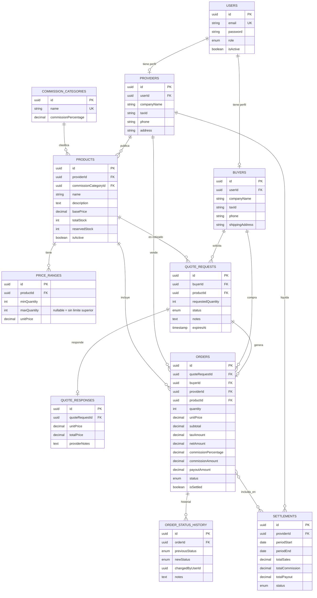

# Diagrama ER - Marketplace B2B

## Notas del modelo

- **USERS** es la entidad base de autenticacion; **PROVIDERS** y **BUYERS** son perfiles 1:1 extendidos segun el rol.
- **PRICE_RANGES** permite tablas de precio por volumen (ej. 1-49, 50-199, 200+) sin solapamiento (validado en la capa de aplicacion).
- **QUOTE_REQUESTS** -> **QUOTE_RESPONSES** -> **ORDERS** modela el flujo: solicitud, respuesta con precio, y al aceptar se genera automaticamente la orden.
- **ORDERS** guarda `commissionPercentage` copiado al momento de la creacion (no una referencia viva a la categoria), para que cambios futuros en las tarifas no alteren ordenes historicas.
- **ORDER_STATUS_HISTORY** da trazabilidad completa de cada cambio de estado de la orden.
- **SETTLEMENTS** agrupa (relacion muchos-a-muchos vía `settlement_orders`) las ordenes en estado `recibida` y no liquidadas previamente dentro de un periodo, calculando venta neta, comision y monto a pagar al proveedor.
